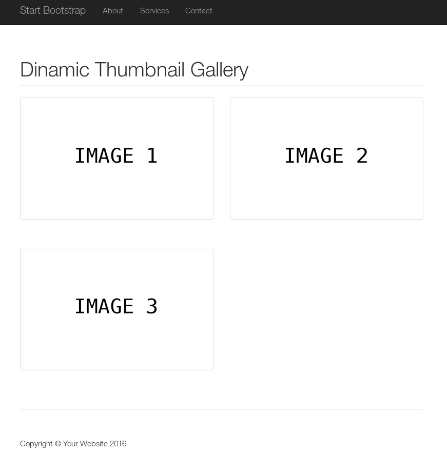

# Dinamic Thumbnail Gallery 

This project allows the creation of a bootstrap dinamic thumbnail gallery with lazy image loading. It displays all images in a directory as thumbnails which can be clicked in order to display the original image.

## Requirements

This project just requires PHP.

## Implementation

This project has been implemented by using the following components:
* The Start Bootstrap [Thumbnail Gallery](http://startbootstrap.com/template-overviews/thumbnail-gallery/) template.
* [jQuery Lazy](http://jquery.eisbehr.de/lazy).
* [fancybox](http://fancybox.net/).

Images are dinamically loaded from the `images` directory using `PHP` scripts. This directory can be changed in the `configuration.php` file.

## Usage

To start using this this project, just clone or download it and put your images into the `images` directory.

